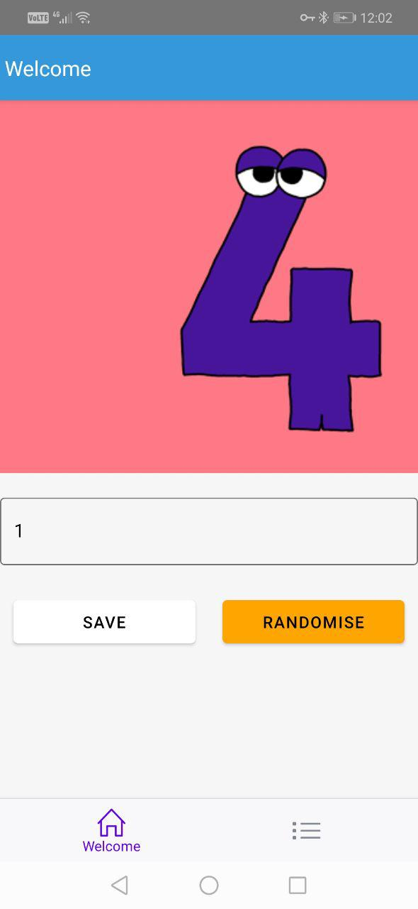
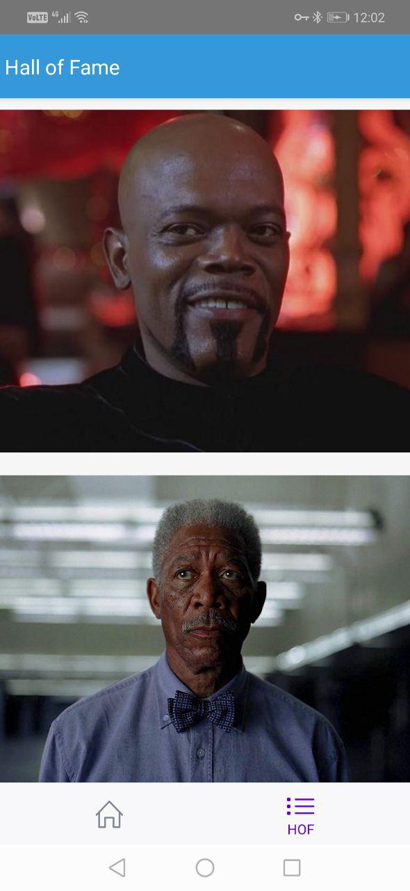

# TP app challenge
This is a sample app to demonstrate React Native knowledge.

Welcome screen             |  Hall of fame screen
:-------------------------:|:-------------------------:
  |  

# PLEASE NOTE
There are some aspects in this challenge that are not fully fulfilled.  
## Intro screen
First of all Intro screen is not implemented and it's easiest screen of all 3.  
I'm going to describe what procedure would look like:  
* The root component(App.js) would render a jsx like this:  

    {this.state.isFirstVisit? <Intro/> : <Main />}
    
* ``isFirstVisit`` comes from ``AsyncStorage.getItem('IS_FIRST_VISIT')`` read.  ``AsyncStorage.setItem('IS_FIRST_VISIT', true)`` is logically called on Intro screen ``componentWillUnmount``.  
* The Intro screen it self is a really simple component utilizing a library like [this](react-native-app-intro-slider).  
## Documentation
Documentation should be more accurate than a README. in an ideal situation (productioan application) I would create a docs dir and create a set of documentations there. The topics that I would document for an application are: architecture and project structure, testing flow, etc.  

## BackHandler section
Also I think the ``BackHandlerHOC`` approach would not seem very appealing. You could make that component a HOC with ``{this.props.children}``. But I somehow thought to program in an OOP manner rather than React style.

# Getting started
* Clone the repository  
``git clone https://github.com/mehrdad-shokri/tp_mobile``
* Install dependencies  
``npm i``
* Start metro bundler  
``react-native start`` OR ``npm start``
* Run application in development environment  
``react-native run-android`` 

# Dependencies clarification
As of the requirement of the project, which mentions the app needs to be scaled to 10x, some architectural decisions are made which I'm going to explain here.  

Redux is utilized for efficient state management and (possible) data transfer between screens.  
Side effect management is satisfied by Sagas.  
To add new generator functions for a scene:
* create a file named as the screen name in the ``app/store/saga``
* update rootSaga located at ``app/store/config/rootSaga``  with your new saga

React Navigation is used for application routing. you can take a look at its setup at ``app/containers/App``  

# Project structure
This project is divided into separate directories based on responsibilities:  
* app  
 Almost all of the app logic resides here. Besides project configuration, business logic resides here.
 
 #### app directory
 * assets  
 Static assets  
 
 * components  
 Presentational components  
 
 * containers  
 Application root screens are located here, almost all of them are connected to redux, have business logic and handle presentational components.  
 
 * store
 All the redux related configurations, reducers, action creators and sagas.  
 
 * utils  
Core js code acting as helper functions or configuring part of the application.  
